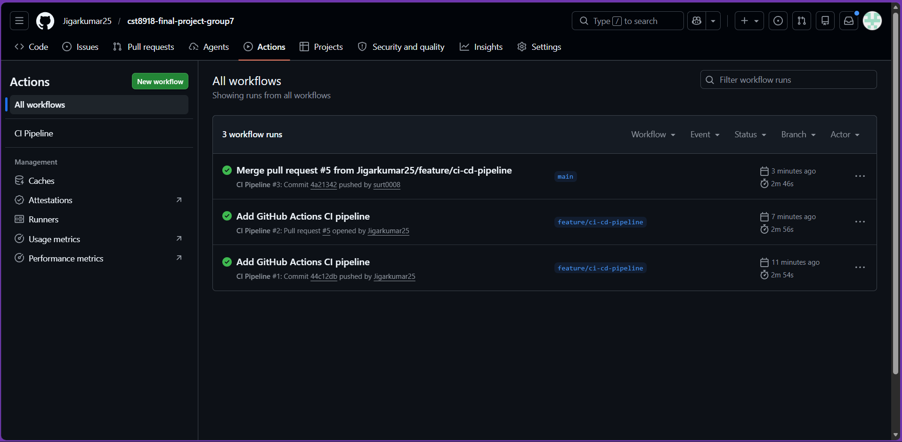
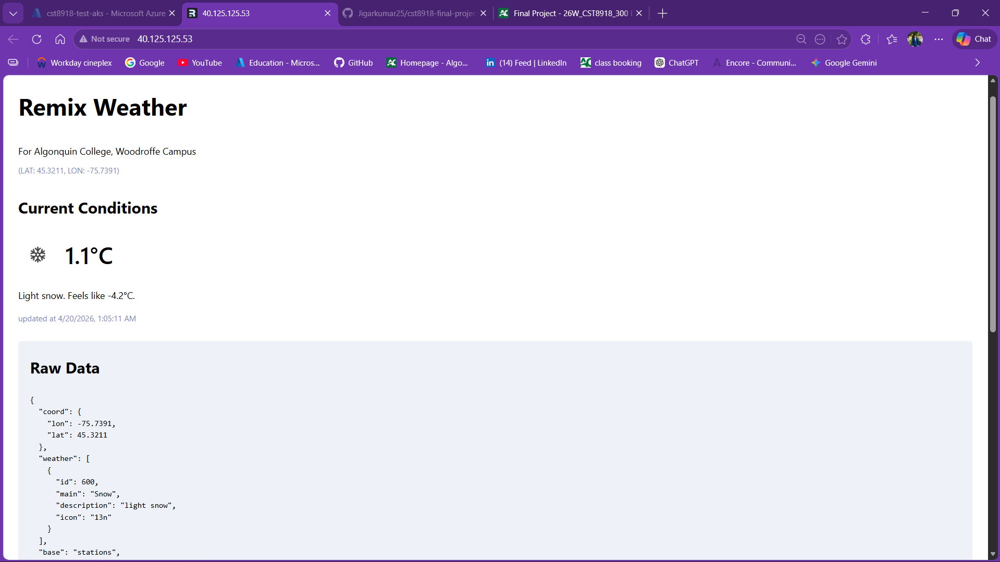

# Cloud Native Weather Application

## Project Overview

This project is a cloud native weather application built and deployed on Microsoft Azure. The application displays real time weather data using a weather API and uses Redis caching to improve performance and reduce repeated API calls.

The project was designed using modern DevOps practices including Infrastructure as Code, containerization, Kubernetes orchestration, and CI/CD automation.

Infrastructure was created using Terraform, the application was containerized using Docker, images were stored in Azure Container Registry, and the application was deployed to Azure Kubernetes Service.

---

## Team Members

- Jigarkumar Patel  
- Rohan Surti  
- Arpitkumar Patel
- Saizal Saini

---

## GitHub Profiles

- Jigar Patel: https://github.com/Jigarkumar25  
- Rohan Surti: https://github.com/surt0008   
- Arpitkumar Patel: https://github.com/arpitk3110
- Saizal Saini: https://github.com/sain02

---

## Team Collaboration

This project was completed as a team effort where all members worked together on planning, development, testing, documentation, and deployment activities. Tasks were divided among team members and progress was managed collaboratively throughout the project lifecycle.

All final code, infrastructure files, workflows, and documentation were consolidated and submitted through one shared GitHub repository for version control and team coordination.

---

## Technologies Used

- Microsoft Azure  
- Terraform  
- Azure Kubernetes Service (AKS)  
- Azure Container Registry (ACR)  
- Docker  
- Kubernetes  
- Redis  
- GitHub Actions  
- Remix  
- Node.js  

---

## Project Features

- Real time weather data display  
- Redis caching for faster responses  
- Public access through Azure LoadBalancer  
- Containerized application deployment  
- Automated CI workflow using GitHub Actions  
- Scalable Kubernetes architecture  
- Secure API key management using Kubernetes Secrets  

---

## Deployment Architecture

User accesses the weather application through a public IP address.

Traffic is routed to Azure Kubernetes Service where the weather application container is running.

The application connects to:

- Redis for caching  
- Weather API for live data  
- Azure Container Registry for container images  

Terraform manages all Azure infrastructure resources.

---

## How to Run the Project

### 1. Clone Repository

```bash
git clone <repository-url>
cd <repository-folder>
```
### 2. Deploy Infrastructure

```bash
cd terraform
terraform init
terraform apply
```

### 3. Build Docker Image

```bash
docker build -t weather-app .
```

### 4. Push Image to Azure Container Registry
```bash
docker tag weather-app <acr-name>.azurecr.io/weather-app
docker push <acr-name>.azurecr.io/weather-app
```

### 5. Deploy to AKS

```bash
kubectl apply -f k8s/test/
```

### 6. Access Application
```bash
kubectl get svc
```
## CI/CD Pipeline

GitHub Actions was used to automate validation and build tasks.

Workflow includes:

- Source code checkout  
- Node.js setup  
- Dependency installation  
- Docker build validation  
- Terraform format check  
- Terraform validation  

**GitHub Actions Screenshot:**  

---

## Screenshots

### Application Running



---

## Challenges Faced

- Kubernetes image pull caching issues  
- Environment variable configuration  
- Redis connectivity inside cluster  
- API key secret configuration  
- Terraform module troubleshooting  

---

## Solutions Implemented

- Used image version tagging  
- Added Kubernetes Secrets  
- Created Redis internal service  
- Used Terraform modular structure  
- Tested deployments using `kubectl logs` and `kubectl describe` commands  

---

## Final Result

The weather application was successfully deployed on Microsoft Azure using a complete cloud native architecture with Infrastructure as Code and CI/CD practices.